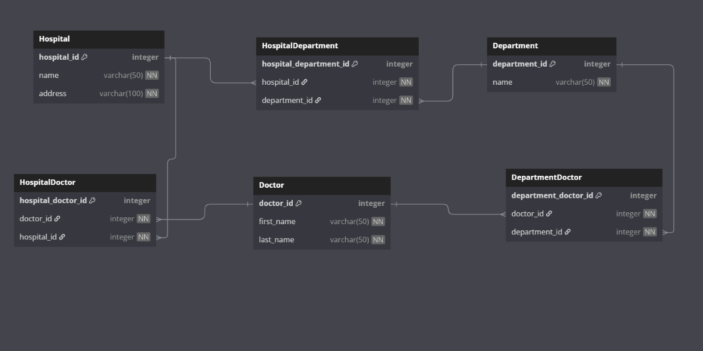

## 0. Hospital example

Going back to the hospital exercise from [exercise0, task 1](https://github.com/AIgineerAB/data_modeling_course/blob/main/exercises/exercise0.md), we will build logical and physical data models. This is the conceptual data model after we've added the composite entities to take care of many-to-many relationships.

a) Create a logical data model using lucidcharts

b) Identify different keys on the various entities

c) Identify child entities and parent entities. What makes them into parent/child relationships?

- A child entity always has the many endpoint connected.
- A parent entity is the "core entity" that enables the child entity to exist.
- A foreign entity refers to the parent entity.

d) Create a physical data model using dbdiagram

Table Hospital {
hospital_id integer [primary key]
name varchar(50) [not null]
address varchar(100) [not null]
}

Table HospitalDepartment {
hospital_department_id integer [primary key]
hospital_id integer [not null, ref: > Hospital.hospital_id]
department_id integer [not null, ref: > Department.department_id]
}

Table Department {
department_id integer [primary key]
name varchar(50) [not null]
}

Table DepartmentDoctor {
department_doctor_id integer [primary key]
doctor_id integer [not null, ref: > Doctor.doctor_id]
department_id integer [not null, ref: > Department.department_id]

}

Table Doctor {
doctor_id integer [primary key]
first_name varchar(50) [not null]
last_name varchar(50) [not null]
}

Table HospitalDoctor {
hospital_doctor_id integer [primary key]
doctor_id integer [not null, ref: > Doctor.doctor_id]
hospital_id integer [not null, ref: > Hospital.hospital_id]

}

e) Create a few tables manually, insert given data plus some more, and try to manually link foreign keys to primary keys. Can you satisfy that a doctor can work at several departments and several hospitals?

- Dr. Toni works at SÖS and Kardiologen
- Dr. Lundgren at Sjukhusstock at both kardiolgen and neurologen
- Dr. Larsson works at both SÖS and Sjukhusstock but only at Neurologen

hospital_table

| hosp_id | name         | address         |
| ------- | ------------ | --------------- |
| 1       | Sjukhusstock | Drottningatan 3 |
| 2       | SÖS          | Södergatan 1    |

hospital_department_table

| id  | hosp_id | dep_id |
| --- | ------- | ------ |
| 1   | 1       | 1      |
| 2   | 1       | 2      |
| 3   | 2       | 1      |
| 4   | 2       | 2      |
|     |         |        |

department_table

| dep_id | name       |
| ------ | ---------- |
| 1      | kardiologi |
| 2      | Neurologi  |
|        |            |
|        |            |

department_doctor_table

| id  | dep_id | dr_id |
| --- | ------ | ----- |
| 1   | 1      | 3     |
| 2   | 1      | 2     |
| 3   | 2      | 2     |
| 4   | 2      | 1     |

doctor_table

| dr_id | name         |
| ----- | ------------ |
| 1     | Lars Larsson |
| 2     | Eva Lundgren |
| 3     | Luca Toni    |
|       |              |

hospital_doctor_table

| id  | hosp_id | dr_id |
| --- | ------- | ----- |
| 1   | 2       | 3     |
| 2   | 1       | 2     |
| 3   | 1       | 1     |
| 4   | 2       | 1     |

## 2. Identify keys

| EmployeeID | Förnamn | Efternamn | AvdelningID | E-post                       | Telefon     |
| ---------- | ------- | --------- | ----------- | ---------------------------- | ----------- |
| 201        | Erik    | Johansson | 1           | erik.johansson@coolfirma.se  | 070-1234567 |
| 202        | Anna    | Karlsson  | 2           | anna.karlsson@coolfirma.se   | 073-2345678 |
| 203        | Johan   | Andersson | 1           | johan.andersson@coolfirma.se | 072-3456789 |
| 204        | Sara    | Lindgren  | 3           | sara.lindgren@coolfirma.se   | 076-4567890 |
| 205        | Maria   | Svensson  | 2           | maria.svensson@coolfirma.se  | 070-5678901 |

a) Which columns could be candidate keys here?

EmployeeID, Epost, telefon

b) From this set of candidate keys, which one would you choose as primary key and which ones as alternate keys?

- Primary key: EmployeeID
- Alternate keys: Epost, telefon

c) Is your primary key considered as natural key or surrogate key?

It is a surrogate key since EmployeeID only exists in this company.

d) Create another table with a primary key where one of the columns in this table could act as a foreign key.

| Lön (USD) | EmployeeID |
| --------- | ---------- |
| 10 000    | 201        |
| 13 000    | 202        |
| 25 000    | 203        |
| 18 000    | 204        |
| 21 000    | 205        |
