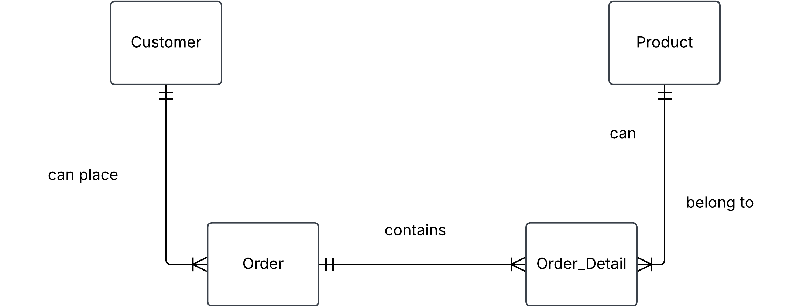

# Exercise 2 - normalizing tables

These exercises are for you to learn fundamental concepts in data modeling. Many of them can be done with pen and paper, physical whiteboard or with an ERD software such as Lucidchart and dbdiagram. It is good practice to work analogue as an important part of data modeling is to align various stakeholders with a mix of technical and business knowledge. It is also advised to discuss with your peers as data modeling usually is not done in solitude.

## 0. Ezecream orders

Our beloved ice cream company Ezecream has a Sales table that looks like this

| order_id | order_date | customer_id | customer_name  | customer_address | product_id | product_name | quantity |
| -------- | ---------- | ----------- | -------------- | ---------------- | ---------- | ------------ | -------- |
| 101      | 2024-04-05 | 05          | Ragnar Lodbrok | Kattegatt 3      | 3          | Blåbärsmagi  | 20       |
| 101      | 2024-04-05 | 05          | Ragnar Lodbrok | Kattegatt 3      | 5          | Lakritsdröm  | 15       |
| 101      | 2024-04-05 | 05          | Ragnar Lodbrok | Kattegatt 3      | 1          | Lichipichi   | 35       |
| 105      | 2025-01-10 | 15          | Feliz Fernadu  | Madridugatan 2   | 8          | Gitlass      | 30       |
| ...      | ...        | ...         | ...            | ...              | ...        | ...          | ...      |

##a) Find different problems with this table, so that Ezecream will take you in for internship to fix it for them

1. - Data redundancy

     --Defintion: Impacts data consistency, increases storage use.Same series of values repeated accross multiple rows.

     --Example: Address and names repeated multiple times. Order_id, customer_id and product_id should be in seperated tables.

2. - Deletion anomaly

     --Definition: Deletion of a record leads to additional unintentional loss of data. You remove more data than you wanted to remove.

     --Example: If we remove row with order 101, and there is no other order linked to product, Blåbärs magi then we lose info about this product.

3. - Insertion anomaly

     --Definiton: Inserting data is not possible beacuse values and attributes are missing, depending on the the constraints of the database.

     --Example Adding a new customer without chosen product and/or quantity

4. - Update anomaly

     --Definiton: Updating/modifying one value leads to inconsitencies with other rows. In other words one would have to update the same info in several places.

     --Example: If we need to update name or address of a customer that is present in several rows, we would have to manually update in each row linked to this, or accept inconsistent data.

   ##-- Markus answer

   a)

you will get redundancy data in customer_name if one cutomer wants more product, same with product_name. It will create a probelm if you wanna delete a product, the hal raw will be deleted.

1. data redundancy
   Defination: same values repeded leads to across multiple rows. Problems, consistnacy increase s storage usage
   Example: look order 101: name + address repeated 3 times.

2. deletion anomaly

- defination: deletion of a records leads to unintentional loss of data. In other you remove data you wanted to remove PLUS data that you should have kept.
- Example: if we remove row with order 101, and there is no ohter order linked to product Blåbärsmagi, then we lose info about this product.

3. Insertion anomaly

- defination: iserting data is not possible because values an attributes are misssing (depends on the constraints an the DB).
- Example: adding a new customer without chosen product and/or quantity.

4. Update anomaly

- Defination: updating modifying are value leads to incositencies with other rows. In other words one would have to update same info in sevral pklaces.
- Example: If we need update name/address of a customer that is present in sevral rows, we would have to manually update it in each row linked to this customer or create inconsistens data.

##b) Does this table satisfy 1NF, 2NF? Motivate.

Regarding 1 NF.

    --Correct: Row order does not matter

    --Correct: Only if we allow an implict PK in form of a
    composite key = order_id, product_id. What if a customer adds a new order, same product with a new quantity.

    --Correct: No repeating groups

    --Correct: Uniform data for the column values.

    2NF = Non-prime attributes must be functional dependent on entire primary key and just not part of it

    - Which columns are primary keys:
    - Which columns are not part of PK
    - Check if this column is functionally dependent on colums that makes a PK
    - IF Yes on All 2NF

    Since we assigned order_id and product_id as primary keys to form composite keys, this proves invalid when customer_name proves dependent on customer_id thats an invalid key.

    ##--Markus answer:

    checklist 1NF

- row order doesn't matter (exists)
- PK in each table (exists) only if we allow an implicit PK in form of a composite key (order_id, product_id).
  Comment: it is not posible for a customer to adds to same order, product with a new quantity.
- No repeting groups (exists)
- Unifor column data (exists) data type can't be mixed within a column, one attribute = one data type

checklist 2NF

- 1NF (exists)
- Non prime attributes must
  be functionally dependes on
  entire primary key and not
  just part of it. (no)

**_question_**

1. Which column/columns are your primary key?
2. Go through each column thats is NOT a part of PK?
3. Check if this column is functionally dependes on column/columns that make a pk?
4. If Yes on all --> 2NF?

c) Normalize this table to 3NF, make conceptual diagram and relational schema notation for each relation. Relational schema notation is `RelationName(attribute1, attribute2, ...)`

Customer

- customer_id (PK)
- customer_name
- address

Order

- order_id (PK)
- order_date
- customer_id (FK)

Product

- product_id (PK)
- product_name
- product_price

Order_Detail

- Surrogate primary key order_detail
- order_id (FK)
- product_id (FK)
- quantity
- price

**conceptual ERD**

d)

Adding price to product and order_detail table

e) Write SQL code to get the total price for Ragnar Lodbrok. Insert data into your tables and test it out.

I used my postgres database from lecture 05, here are my syntax:

SET search_path to ezecream_05;

SELECT
c.first_name,
c.last_name,
SUM(p.price \* ol.quantity) AS total_price
FROM customer c
JOIN orders o ON c.customer_id = o.customer_id -- Join customer on orders
JOIN orderline ol ON o.order_id = ol.order_id -- Get orders with orderlines
JOIN product p ON p.product_id = ol.product_id -- Get product
WHERE c.first_name = 'Ivar' AND c.last_name = 'the Boneless'  
GROUP BY c.first_name, c.last_name;

## 1. Sakila

Use the same ERD from Sakila as in exercise1 task 3.

a) Is this normalized to 3NF?

Yes it is since it first fufills 1NF, 2NF where all data i dependent on the prmary key and for 3nf since I cant find any transitional dependencies for the non key attributes.

b) Lets zoom in to the inventory, explain how it works for tracking films in each store.

Through film table (FK) that contains all relevant info for each film, through connection to store (FK) where each customer makes a rental, ental table in turn has inventory_id as FK.

Chatgpt:

Here’s how a rental transaction is tracked through the database:

A store stocks movies → inventory table has film_id and store_id.
A customer rents a movie → rental table records the inventory_id, linking the rental to a specific movie copy.
The movie is returned → The return_date field in the rental table is updated.
Payment is recorded → payment table records the rental transaction, linking it to rental_id.

c) Do we have a way to know if a film is rented out or not?

Yes by linking rental_id with rental_date and return_date, if there are a null value in return_date then the film is rented out.

## 2. Revisiting the doctor example

Remember the doctor, hospital and department example from exercise0 and exercise1.

a) Does the design fulfill 3NF, motivate based on the rules for the normal forms.

It fufills 1NF: - It does have primary keys - No repeatig groups - Each column has unique/single variable type - No ordering of data

It fufills 2NF:

It is in 1NF.

All non primary key attributes are unctionally dependent on the primary key.

It fufills 3NF:

It is in 2NF.

There are no partial dependencies on the primary key, all mon primary keys are fully dependent on the primary key.

b) You should have realised from this question in exercise1 0e)

> "Create a few tables manually, insert given data plus some more, and try to manually link foreign keys to primary keys. Can you satisfy that a doctor can work at `several departments and several hospitals?`"

that this creates ambiguity. This can be solved with a ternary relationship, which connects three entities simultaneously. Now make a new iteration for this data model.

ERD with help from chatgpt:

Where there exist 1:M relationship between hospital depratment and doctor towards hospitaldepartment and workplacedoctor. 

See sql folder for the syntax for the creation of this table.

data_modeling_course_db=# select * from exercise2b.workplace_doctor ;
 doctor_id | department_id | hospital_id 
-----------+---------------+-------------
         1 |             2 |           1
         1 |             2 |           2
         2 |             1 |           1
         2 |             2 |           1
         3 |             1 |           2

set search_path to exercise2b;

select 
    d.name,
    h.name,
    dep.name
from workplace_doctor wd
JOIN doctor d ON wd.doctor_id = d.doctor_id -- get name  
JOIN hospital h ON wd.hospital_id = h.hospital_id -- get hospital name
JOIN department dep ON wd.department_id = dep.department_id; -- get department

c) In your design do you have bridge tables as well in addition to the ternary relationship. Motivate why you should or should not have them.

I use hospitaldepartment as a briding table since: 
- Doctors can be assigned to departments that doesnt exist within a hospital.
- Prevents redundant data, e.g. if a department closes down you dont have to update every doctors related department affiliation.
- Workplace_dctor relies on HD table o be assigned valid hd combinations.
- Easier for writing queries. 

## 3. Theoretical questions

a) What are the differences between first, second, third normal forms?

1NF: 
- It does have primary keys 
- No repeatig groups 
- Each column has unique/single variable type 
- No ordering of data

It fufills 2NF:

It is in 1NF.

All non primary key attributes are functionally dependent on the primary key.

It fufills 3NF:

It is in 2NF.

There are no partial dependencies on the primary key, all mon primary keys are fully dependent on the primary key.

b) Can a normalized design still have flaws? Can you come up with example where this might happen?

- Over normlization may require more complex joins.
- Can emerge problems where the data meets the real world. E.g. if a customer address are saved in a table but in the real world a customer can have different home address and billing addres.
- Can be hard to track old data if it´s not formally named.
- Unnecessary/complex dividing of tables. E.g. seperating diagnose name with diesease ID in different tables will make it hard for health care personel to the most easy information. 
- 

c) If a > b and b > c, then a > c. What could this pattern be called?

A transistive depedency. E.g. student_id -> student_department, student_department -> department_name. Thus is student department name inderctly determined by their ID

d) When is ternary relationship needed?

It´s needed when a relationship involves three enteties that must be considered together to accuratley represent the data. By splitting them into binary tables we lose relevant dependencies and we have to create unnecessary tables.  

e) In general how far do you need to normalize your design?

Enough to eliminate redundancy and ensure data integrity, but not so much that it hurts performance or makes queries unnecessarily complex. The goal is to balance normalization with practical usability.

f) What's the purpose of normalizations?

- To ascertain data integrity. 
- Eliminates data redundancy and duplicate data
- Prevent data anomalies (inserting, updating and deleting issues)
- Improves query efficency 
- Maintain Logical & Scalable Database Structure

g) Is a ternary relationship a bridge table

Yes it is since it´s only based on foerign keys. 

| **Glossary**               | **Correct Meaning** |
|----------------------------|--------------------|
| **Normalization**          | The process of structuring a relational database to minimize redundancy and improve integrity by organizing data into tables following specific normal forms. |
| **Insertion anomaly**      | A situation where you cannot insert data into a table without additional, unnecessary data. This typically occurs in poorly designed databases. |
| **Update anomaly**         | An issue where updating a piece of data in one place requires multiple updates in different locations due to data redundancy, leading to inconsistencies. |
| **Deletion anomaly**       | A problem where deleting data unintentionally removes other important data due to poor database design (e.g., removing the last product of a supplier also deletes supplier details). |
| **Normal forms**           | A series of rules (1NF, 2NF, 3NF, BCNF, etc.) that databases must follow to reduce redundancy and anomalies while improving integrity and efficiency. |
| **Boyce-Codd Normal Form (BCNF)** | A stricter version of 3NF where every determinant must be a candidate key, ensuring there are no partial dependencies on non-key attributes. |
| **Transitive dependency**  | A condition where a non-key attribute depends on another non-key attribute, rather than depending directly on the primary key (e.g., A → B, B → C, thus A → C). |
| **Functional dependency**  | A relationship where one attribute uniquely determines another attribute (e.g., in a table with StudentID → StudentName, StudentID functionally determines StudentName). |
| **Ternary relationship**   | A direct relationship involving three entities in an ER model, where all three participate in a meaningful way (e.g., a relationship between Doctor, Patient, and Medication in a hospital system). |
| **Composite primary key**  | A primary key that consists of two or more attributes, often used in junction tables (e.g., in a many-to-many relationship). |
| **Relational schema notation** | A formal way of representing the structure of a relational database, including tables, attributes, and relationships, often written as **TableName(Attribute1, Attribute2, ...)**. |
| **Entity constraints**     | Rules that define valid relationships between entities, such as **key constraints** (each row must have a unique identifier), **referential integrity** (foreign keys must match primary keys), and **cardinality constraints** (e.g., one-to-one, one-to-many, many-to-many relationships). |
