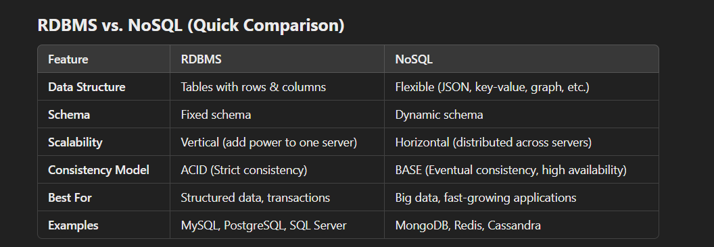

## 0

## 1)

```json
{
  "hospital": "Sjukhusstock",
  "address": "Drottninggatan 3, Stockholm",
  "departments": [
    {
      "name": "Kardiologi",
      "doctors": [
        { "id": 1, "name": "Dr. Abra Abrahamson" },
        { "id": 2, "name": "Dr. Erika Eriksson" }
      ]
    },
    {
      "name": "Neurologi",
      "doctors": [{ "id": 3, "name": "Dr. Sven Svensson" }]
    }
  ]
}
```

###

Initial naive conceptual ERD


**Initial 3 tables**

Hospital table

| hosp_id | name         | address         |
| ------- | ------------ | --------------- |
| 1       | Sjukhusstock | Drottningatan 3 |
| 2       | SÖS          | Södergatan 1    |

Department table

| dep_id | name       |     |
| ------ | ---------- | --- |
| 1      | kardiologi |     |
| 2      | Neurologi  |     |
|        |            |     |
|        |            |     |

Doctor table

| dr_id | name |     |
| ----- | ---- | --- |
| 1     | Lars |     |
| 2     | Eva  |     |
| 3     | Luca |     |
|       |      |     |


## Expandera alt + shift + f

## Lägg till rader shift + alt ned

**Structure with 6 tables**

hospital_table

| hosp_id | name         | address         |
| ------- | ------------ | --------------- |
| 1       | Sjukhusstock | Drottningatan 3 |
| 2       | SÖS          | Södergatan 1    |

hospital_department_table

| id  | hosp_id | dep_id |
| --- | ------- | ------ |
| 1   | 1       | 1      |
| 2   | 1       | 2      |
| 3   | 2       | 1      |
| 4   | 2       | 2      |
|     |         |        |

department_table

| dep_id | name       |
| ------ | ---------- |
| 1      | kardiologi |
| 2      | Neurologi  |
|        |            |
|        |            |

department_doctor_table

| id  | dep_id | dr_id |
| --- | ------ | ----- |
| 1   | 1      | 3     |
| 2   | 1      | 2     |
| 3   | 2      | 2     |
| 4   | 2      | 1     |

doctor_table

| dr_id | name         |
| ----- | ------------ |
| 1     | Lars Larsson |
| 2     | Eva Lundgren |
| 3     | Luca Toni    |
|       |              |

hospital_doctor_table

| id  | hosp_id | dr_id |
| --- | ------- | ----- |
| 1   | 2       | 3     |
| 2   | 1       | 2     |
| 3   | 1       | 1     |
| 4   | 2       | 1     |

##Test a join##

- Dr. Toni works at SÖS and Kardiologen
- Dr. Lundgren at Sjukhusstock at both kardiolgen and neurologen
- Dr. Larsson works at both SÖS and Sjukhusstock but only at Neurologen

Want information on Sjukhusstock and its departments

- hospital_department can join with department_id on
  department table and hospital_id on hospital_table
- Query name from hospital table and name from department
  table

SELECT
d.name AS doctor_name,
h.name AS hospital_name,
dep.name AS department_name
FROM hospital_doctor hd
JOIN doctor d ON hd.dr_id = d.dr_id -- Get doctor name
JOIN hospital h ON hd.hosp_id = h.hosp_id -- Get hospital name
JOIN department_doctor dd ON d.dr_id = dd.dr_id -- Get department for doctor
JOIN hospital_department hdpt ON hd.hosp_id = hdpt.hosp_id -- Link hosp/dep
JOIN department dep ON dd.dep_id = dep.dep_id -- Get department name
ORDER BY doctor_name, hospital_name;

##2 Library Bookly

A library called Bookly keeps track of books and members who borrow them. Each book has a title, author, and ISBN number. Each member has a membership ID, name, and contact information. A member can borrow multiple books, but each book can be borrowed by only one member at a time.

##a) Identify the `entities` and `attributes` for each entity.

book_table

| book_id | title               | author       | ISBN |
| ------- | ------------------- | ------------ | ---- |
| 1       | Mein Kampf          | Adolf Hitler | 1111 |
| 2       | The art of the deal | Donald Trump | 2222 |
| 3       | Mina 1000 mål       | Luca Toni    | 3333 |

member_table

| memb_id | name           | contact_info         |
| ------- | -------------- | -------------------- |
| 1       | Karl Karlsson  | nazi@gmail.com       |
| 2       | Virgina Hansen | magamaga@gmail.com   |
| 3       | Luca Toni      | primapunta@gmail.com |

library_table

| borrow_id | book_id | memb_id |
| --------- | ------- | ------- |
| 1         | 1       | 1       |
| 2         | 2       | 2       |
| 3         | 3       | 3       |

book_table och member_table are entities, library tables is an associative entity. Title, author, ISBN are attributes in book_table and name and contact_info are attributes from member_table.

##b) Write out the relationship labels.

Cardinality:

1:M, (memb <-> library) One book can be borrowed zero or multiple times but only by one borrowing at a time
1:M, (book <-> library) One member can borrow multiple books but only one book at a time

The ERD are runned from the left.


##c) Describe the relationships between the entities (one-to-many, one-to-one and many-to-many).

1:M, One book can be borrowed multiple times but only by one member at a time (book)
1:1, One book can be linked to only one unique ISBN number (memb <-> lib)
M:N, Many members can borrow many books (but only one at a time) (book <-> lib <-> memb)

##d) Define the relationship statement for example: "A Customer can have one or more Rentals".

1:M

## 3. Conceptual ERD to words

This is an ERD conceptual diagram that a database designer and the business stakeholders agreed upon in a car rental company called Carent.


a) Describe the entities in this conceptual ERD.

Car and customer are object entities, rental associative.

b) Write out the relationship labels.

- Customer rents a car
- Rental gives a car

c) Describe the relationships between the entities (one-to-many, one-to-one and many-to-many).

- Customer <-> Rental one-to-many 0..1:M
- Rental <-> Customer many-to-one M:0..1
- Rental <-> Car many-to-one M:0..1
- Car <-> Rental one-to-many 0..1:M

d) Define the relationship statement for example: "A Customer can have one or more Rentals".

Customer <-> Rental one-to-many 0..1:M - The customer can have one or zero rentals, but the rental may have one or many customers.
Rental <-> Car one-to-many M:0..1 - A rental may have one or many cars, but each car can only belong to a rental at a time or none at all.

## 4. Online store

You are designing a database for an online store that sells multiple products. Customers can place multiple orders, and each order contains multiple products.

a) Identify entities and their relationships

customer (customer_table), products (products_table) are object entities, whereas order_table and order_items_table are bridging tables/ associative enteties.

products_table

| prod_id | product    |
| ------- | ---------- |
| 1       | usb        |
| 2       | data mus   |
| 3       | datorskärm |

customer_table

| cust_id | name           |
| ------- | -------------- |
| 1       | Karl Karlsson  |
| 2       | Virgina Hansen |
| 3       | Luca Toni      |

order_table

| order_id | cust_id | order_date |
| -------- | ------- | ---------- |
| 1        | 1       | 2025-03-05 |
| 2        | 2       | 2025-03-04 |
| 3        | 3       | 2024-03-03 |

order_items_table

| order_item_id | order_id | prod_id |
| ------------- | -------- | ------- |
| 1             | 1        | 1       |
| 2             | 1        | 2       |
| 3             | 2        | 3       |
| 4             | 3        | 2       |

Karl Karlsson buys one usb mouse and one mouse
Virgina Hansen buys one datorskärm
Luca Toni buys one data mus

b) Create a conceptual ERD with cardinalities

- customer_table -> order_table 1:M
- order_table -> order_items_table 1:M
- order_items_table -> products_table 1:M


## 5. University management system

A university needs a system to manage students, courses, and professors.

- each student can enroll in multiple courses.
- each course is taught by one professor.
- a teacher can teach multiple courses.

a) Identify entities and their relationships

Object enteties are students, courses and professors. Associte/bridging enteties are course_stud_table

b) Come up with possible attributes for the entities

students_table

| stud_id | name              |
| ------- | ----------------- |
| 1       | Lars Larsson      |
| 2       | Harry Potter      |
| 3       | Fredrick Nietzche |

courses_table

| cour_id | name                 |prof_id
| ------- | -------------------- |
| 1       | grus och sten 7,5 hp |1
| 2       | Haxxor skillZ        |2
| 3       | Memecoins            |3

professor_table

| prof_id | name               |
| ------- | ------------------ |
| 1       | Aristoteles        |
| 2       | Anna Öhman         |
| 3       | Professor Mcnogall |

course_stud_table

| cour_stud_id | cour_id | stud_id |
| ------------ | ------- | ------- |
|              |         |         |
|              |         |         |
|              |         |         |

c) Draw conceptual ERD with cardinalities

- students_table -> course_stud_table 1:M
- course_stud_table -> courses_table M:1
- courses_table -> prof_table M:1


d) Define business rules (e.g. a student can enroll in max 4 courses)

- 1. A student must be enrolled in at least 1 course to be active.
- 2. A course can have between 0 and 40 students.
- 3. Each course must have exactly one professor.
- 4. A professor can teach up to 5 courses.

## 6. Onshop

An e-commerce platform Onshop manages customers, orders, and products.

- a customer can place multiple orders.
- each order contains multiple products.
- a product can belong to multiple categories.

a) Identify key entities and their attributes (e.g., customer_name, order_date)

- Object entities are (atributes): category_table (category name), product_table(product, price usd, stock quantity), order_table (order date), category_table(category name), customer_table(name)

- Associative entities are: prod_cat_table, order_items_table.

category_table

| category_id | category name |
| ----------- | ------------- |
| 1           | elektronik    |
| 2           | fordon        |
| 3           | djur          |

product_table

| prod_id | product name | price usd | stock quantity |
| ------- | ------------ | --------- | -------------- |
| 1       | usb          | 10        | 100            |
| 2       | data mus     | 10        | 100            |
| 3       | bil lampa    | 25        | 100            |
| 4       | hund släde   | 250       | 20             |
| 5       | katt         | 50        | 20             |

prod_cat_table

| prod_id | cat_id | prod_cat_id |
| ------- | ------ | ----------- |
| 1       | 1      | 1           |
| 2       | 1      | 2           |
| 2       | 3      | 3           |
| 3       | 1      | 4           |
| 3       | 2      | 5           |
| 4       | 2      | 6           |
| 4       | 3      | 7           |
| 5       | 3      | 8           |

customer_table

| cust_id | name           |
| ------- | -------------- |
| 1       | Karl Karlsson  |
| 2       | Virgina Hansen |
| 3       | Luca Toni      |

order_table

| order_id | cust_id | order_date |
| -------- | ------- | ---------- |
| 1        | 1       | 2025-03-05 |
| 2        | 2       | 2025-03-04 |
| 3        | 3       | 2024-03-03 |

order_items_table

| order_item_id | order_id | prod_id |
| ------------- | -------- | ------- |
| 1             | 1        | 1       |
| 2             | 1        | 2       |
| 3             | 2        | 3       |
| 4             | 3        | 2       |

b) Sketch the conceptual ERD.


c) Define business rules

- Customers & Orders → Every order must be linked to a customer.
- Orders & Products → A product cannot appear more than once in the same order.
- Products & Categories → Every product must belong to at least one category.
- Inventory & Pricing → Stock quantity cannot be negative.
- Data Integrity → Foreign keys must be enforced to maintain data consistency.

## 7. Theoretical questions

a) What is a conceptual data model, and why is it important?

Beacuse a CDM gives the sketching or drawing of how to organize a data pipeline, structure of consumer model for a company etc.

GPT:

"A Conceptual Data Model (CDM) provides a high-level sketch or blueprint of how data is structured and organized within a system. It helps define entities, relationships, and business rules without focusing on technical implementation, making it useful for designing data pipelines, consumer models, and overall company data strategy."

b) Storing age in a database, is that a good idea, why?

No since it changes and requires updates. Its better to have an ID number and use datetime to update. 

c) What are the three types of data structures, and how do they differ?


- Linear → Sequential → Task scheduling (Queue), music playlists, undo/redo functionality. IRL: Excel
- Hierarchical → Parent-child → File systems (Tree), organization charts, search engine rankings. IRL: Operative systems
- Graph → Interconnected nodes → Social networks (Graph), GPS navigation, recommendation systems. IRL: Instagram


d) Give examples of how each data structure is used in real-world applications

See above

e) What is cardinality in data modeling, and why is it important?

Its the concept of giving an order structure of flow of data between diffrent entities. It´s important to map out to streamline the data efficent. 

GPT: 

Refined Version of Your Answer:
"Cardinality in data modeling defines the number of relationships between different entities, such as one-to-one, one-to-many, or many-to-many. It is important because it helps design efficient database structures, ensuring data consistency and optimizing performance."

f) What are the different steps of data modeling?

Identify entities and their relationships, identify their attributes. Design an conceptual ERD. Implement this structure in a data system, e.g. dbeaver, then import data, after that sttreamline it with e.g. docker compose/postgres. 

GPT:

- Identify Entities & Relationships → Define key objects (e.g., Customers, Orders) and their connections.
- Identify Attributes → Assign properties (e.g., customer_name, order_date) and define keys.
- Design Conceptual Model → Create an ERD to visualize entities and relationships.
- Develop Logical Model → Structure the schema with tables, relationships, and constraints.
- Implement Physical Model → Create the database in PostgreSQL, MySQL, or DBeaver.
- Load & Test Data → Insert sample data and validate queries.
- Optimize & Maintain → Use indexing, normalization, and tools like Docker Compose for scalability.


g) What factors influence the choice between using an RDBMS and NoSQL?

GPT:

Conclusion:
Choose RDBMS for structured data, complex queries, and consistency.
Choose NoSQL for high scalability, flexible schema, and handling large, diverse datasets.



## Glossary

- RDBMS: Relational Database Management System.
Relational Model: A database model that organizes data into tables with relationships.
- Conceptual Model: A high-level model that gives an overview of a data structure and its relationships.
- Logical Model: A detailed model that defines entities, attributes, relationships, and constraints without implementation details.
- Physical Model: A model that defines how data is physically stored in a database system.
- ERD: Entity-Relationship Diagram, a visual representation of data relationships.
- Data Modeling: The process of designing a database, from conceptualization to implementation.
- Data Integrity: Ensuring accuracy, consistency, and reliability of data in a database.
- Data Consistency: Ensuring that data remains uniform and correct across all systems and transactions.
Field: A single piece of data in a database table (e.g., "customer_name").
- Attribute: A property or characteristic of an entity (e.g., name, price, order_date).
- Data Type: Defines the type of data stored in a field (e.g., INT, VARCHAR, DATE).
- Tuple: A row in a relational database table representing a single record.
- Data Redundancy: Unnecessary duplication of data, which can lead to inconsistency.
- Transaction: A sequence of database operations that must be executed as a single unit.
- Cardinality: Defines the number of relationships between entities (one-to-one, one-to-many, many-to-many).
- One-to-One: A relationship where one entity is related to only one other entity (e.g., a person and their passport).
- One-to-Many: A relationship where one entity is related to multiple entities (e.g., one customer placing multiple orders).