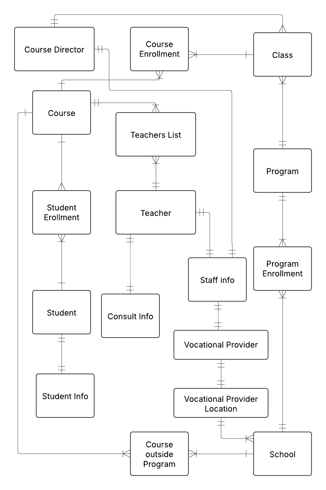
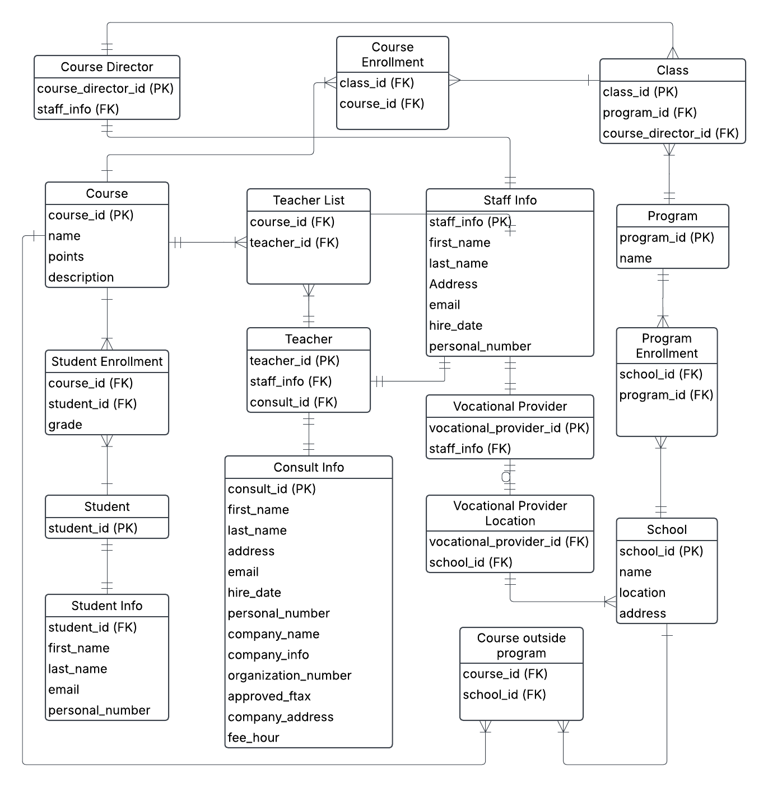
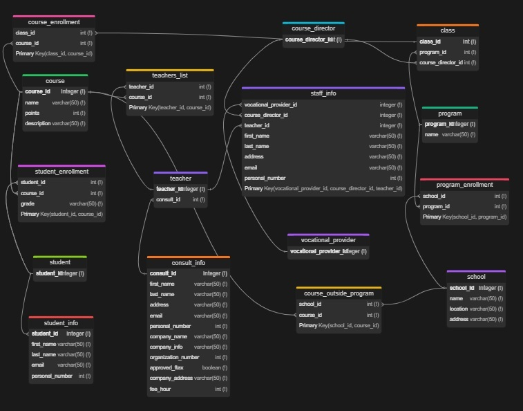

#Objective 0 - Data modeling

## a)

Done

## b)

## c)

School - Program Enrollment
- A school may have many program enrollments, but each program enrollment is linked to one individual school.

Program – Program Enrollment
- A program may have many program enrollments, but each program enrollment is linked to one individual program.

Program - Class
- A Program may have many classes, but each class are linked to one individual Program

Class – Course Enrollment
- A class may have many course enrollments, but each enrollment is linked to one Course.

Course – Course Enrollment
- A Course may have many course enrollments, but each enrollment are linked to one indivudal class.

Course – Course outside Program
- One or more courses may be listed in Courses outside Program , but each record Courses outside Program is linked to one Course.

School - Course outside Program
- A School may have many records in Courses outside Program, but each record in Courses outside Program is linked to one indivudal School.

Course - Student Enrollment
- A course may have many student enrollments, but each student enrollment is linked to an indivudal course.

Student Enrollment - Student
- A student may have many enrollments, but each enrollment is linked to one indivudal Student.

Student - Student Info
- Each student has an individual record in student info, and each Student Info record is linked to one indivudal Student.

Vocational Provider Location - School
- A Vocational Provider Location record may be linked to many schools , but each School is linked to one Vocational Provider Location record.

Vocational Provider - Vocational Provider Location 
- A Vocational Provider may be linked to one record in Vocational Provider Location , and each Vocational Provider record linked to one Vocational Provider .

Vocational Provider - Staff Info
- Each Vocational Provider has one individual record in Staff Info, and each Staff Info record is linked to one Vocational Provider. 

Course Director - Class
- A Course Director manages three classes, but each class has one personal Course Director assigned to it. 

Course Director - Staff Info
- Each Course Director has an individual record in Staff Info, and each record in Staff Info is linked to one Director. 

Teacher - Teachers List
- One or many teachers may have a record in Teachers List, but each record in Teachers List refers to one teacher.

Course - Teachers List
- One or many courses may have a record in Teachers List, but only one teacher from Teachers List is linked to one course.

Teacher - Staff Info
- Each teacher has one individual record in Staff Info, and each record in Staff Info is linked to one teacher. 

Teacher - Consult Info
- If a teacher is a consultant they will have an individual record in Consult Info, and each record in Consult Info is linked to one teacher if she or he is an consultant. 

## d)

## e)

For syntax run 0e.dbml

## f)

My physical model fufills 3NF beacuse it first off fufills 1NF since:

- Each column contain only value per row, no list, sets or arrays
- Each table has a primary key that uniquely identifies each row
- Each column contains data of the same type
- Rows and columns are unordered

Secondly it fufills 2NF since:

- It is already in 1NF
- All attributes are functionally dependent on the entire primary key. E.g the attribute "grade" in student_enrollment are dependent on the whole composite-primary key and not just course_id or student_id, since a student must take a course in order to get a grade. 

Third, it fufills 3NF since:

- All my non-prime attributes depend on the whole primary key. Even in the table with the most attributes like consulti_info, all of them depend soley on consult_id, i.e. there are no transitive dependencies between non-prime attributes. 

I reached this level of normalization by dividing my entities and many to many relationships into the right amount of tables.  

